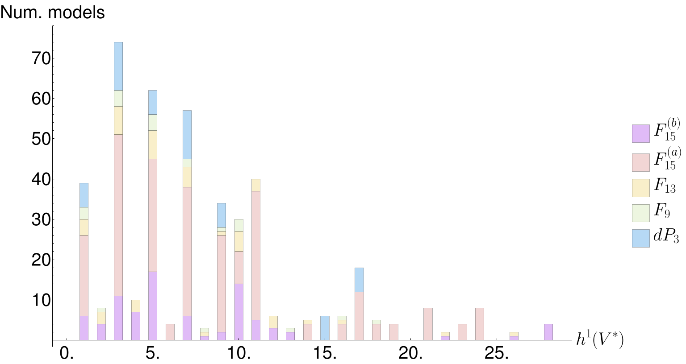
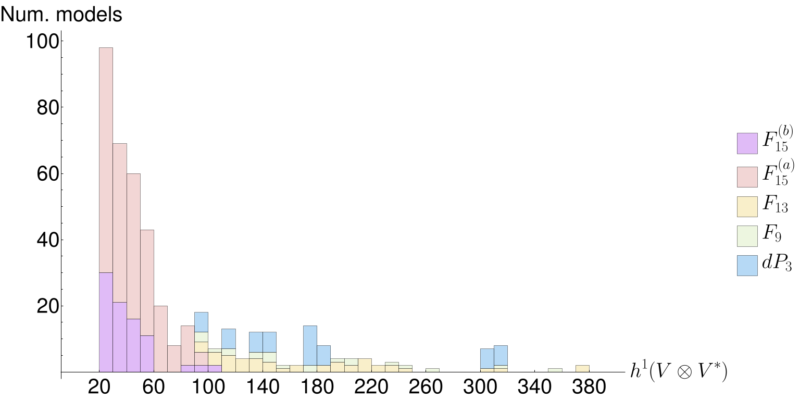

# lb_models_on_ellfibs

The accompanying code for the model scan in the paper [Heterotic Line Bundle Models on Elliptically Fibered Calabi-Yau Three-folds](https://arxiv.org/abs/1706.07688).

--- 

 | 
:------:|:------:
Frequency plot of $h^1(V)$ combined for all base spaces | Frequency plot of $h^1(V \otimes V^*)$ combined for all base spaces

